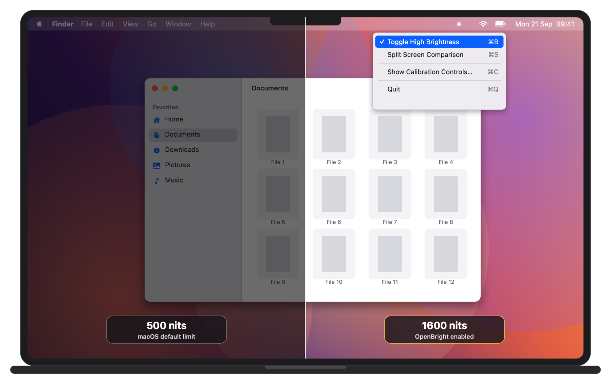

# OpenBright ☼

**Unlock the full 1600 nits of a MacBook Pro's Liquid Retina XDR display for everyday use, with native Metal APIs.**

[](LICENSE)
[](#requirements)
[](https://github.com/saan-dev/openbright/actions/workflows/build.yml)
[](https://github.com/saan-dev/openbright/releases/latest)

<p align="center">
  
</p>
<p align="center"><sub>Illustration. Screenshots cannot capture backlight brightness, so the difference is simulated; the menu is the real one.</sub></p>

## What it does

macOS caps the desktop at about 500 nits and reserves the remaining backlight headroom for HDR content. OpenBright makes the display controller engage that headroom for everything on screen, so the whole desktop can reach the panel's full 1600 nits. It is useful outdoors, next to a bright window, or anywhere the standard maximum is not enough.

It is a free, MIT-licensed alternative to paid tools such as Vivid, BetterDisplay, and BrightIntosh.

- **Menu bar toggle.** A sun icon in the menu bar. Click it, or press ⌘B from the menu, to switch the boost on or off.
- **Split screen comparison.** Boosts only the right half of the screen so you can see the difference side by side.
- **Calibration panel.** Two sliders for the signal strength and the overlay transparency, with a reset to the tested defaults.
- **Battery protection.** On battery below 20 percent the boost switches off and you get a notification.
- **Remembers its state.** Enabled state and calibration values survive a restart.

## Requirements

- A Mac with a Liquid Retina XDR display: the 14-inch and 16-inch MacBook Pro from 2021 onward. Other Apple Silicon Macs, including the 13-inch MacBook Pro and MacBook Air, have no extra headroom to unlock.
- macOS 12 Monterey or later.

## Download

Grab `OpenBright_Installer.dmg` from the [latest release](https://github.com/saan-dev/openbright/releases/latest), open it, and drag OpenBright to Applications. Every release is built from source on a clean macOS runner by the [CI workflow](.github/workflows/build.yml).

### First launch

OpenBright is not signed with a paid Apple Developer ID, so Gatekeeper blocks it the first time.

On **macOS 15 Sequoia and later**:

1. Open OpenBright. macOS says it could not verify the app. Click **Done**.
2. Open **System Settings → Privacy & Security**, scroll down, and click **Open Anyway** next to the OpenBright message.
3. Confirm with **Open Anyway** in the dialog.

On **macOS 12 to 14**: right-click `OpenBright.app`, choose **Open**, then confirm **Open**.

This is needed once. If you built the app yourself, the build script removes the quarantine flag and no prompt appears.

## How it works

OpenBright uses no private APIs, system hacks, or firmware changes. It relies on standard frameworks only: Metal, Core Animation, and Cocoa.

### 1. A transparent EDR overlay

The app creates a borderless, click-through `NSWindow` covering the screen, above the menu bar level and present on every Space. Its content is a `CAMetalLayer` configured for extended dynamic range:

- **Pixel format** `rgba16Float`, so components can exceed 1.0.
- **Color space** `extendedLinearDisplayP3`, which permits values outside the SDR range.
- `wantsExtendedDynamicRangeContent = true`, which tells the compositor this layer carries EDR content.

### 2. Pixel injection

Every 100 ms the layer is cleared to a single color and presented. The color is what makes the trick work:

- **RGB** `850.9` in linear P3. Any component far above 1.0 counts as HDR content, and the compositor raises the display's EDR headroom to show it, which drives the backlight up for the whole panel.
- **Alpha** `0.0000435`. The layer has to be non-transparent enough that the window server does not cull it as invisible, yet transparent enough that the injected color is imperceptible on top of the desktop. This value sits in that window.

Both values were found empirically. The calibration panel exists so you can tune them for your own panel and taste.

### 3. Battery protection

Once a minute, while the boost is on, the app runs `pmset -g batt` and parses the output for the power source and charge level. If the Mac is on battery power below 20 percent, the boost is disabled, the preference is saved, and a notification explains why.

### 4. Persistence

The enabled state and both calibration values are stored in `UserDefaults` and restored at launch.

## Trade-offs

- **Power.** Driving the backlight at full range costs substantially more power. Expect noticeably shorter battery life while the boost is on, which is why the low-battery cutoff exists.
- **Heat.** The panel and its driver run warmer at 1600 nits. Apple's own HDR playback has the same behavior; sustained use is up to you.
- **Color.** The overlay itself is imperceptible at the default alpha, and SDR content is not tone-mapped, so hues stay the same and the whole image simply gets brighter. Still, turn the boost off for color-critical work.
- **Single display.** The overlay covers the main screen only. External displays are not affected.

## Project structure

```text
OpenBright/
├── Sources/
│   ├── main.swift             # App delegate and entry point
│   ├── DisplayControls.swift  # Menu bar item, menu, preferences, battery monitor
│   ├── OverlayWindow.swift    # Click-through full-screen window, split-screen framing
│   ├── EDRView.swift          # CAMetalLayer setup and the render loop
│   └── ControlPanel.swift     # Floating calibration panel
├── Scripts/
│   ├── build_app.sh           # Compiles the sources into OpenBright.app with icon and Info.plist
│   ├── package_dmg.sh         # Wraps the app in a drag-to-Applications DMG
│   └── generate_icon.swift    # Draws the source icon PNG
├── Assets/
│   ├── app_icon_sun.png       # Source asset for the app icon
│   └── readme/                # README illustrations
└── .github/workflows/
    └── build.yml              # CI: build, package, and publish a release on v* tags
```

## Build from source

Requires the Xcode Command Line Tools (`xcode-select --install`). No Xcode project; the sources are compiled directly with `swiftc`.

Build the app bundle:

```bash
./Scripts/build_app.sh
open OpenBright.app
```

Package it as a DMG:

```bash
./Scripts/package_dmg.sh
```

Both scripts work from any directory and write their output to the repository root. The same two scripts run in CI.

## License

MIT. See [LICENSE](LICENSE).
